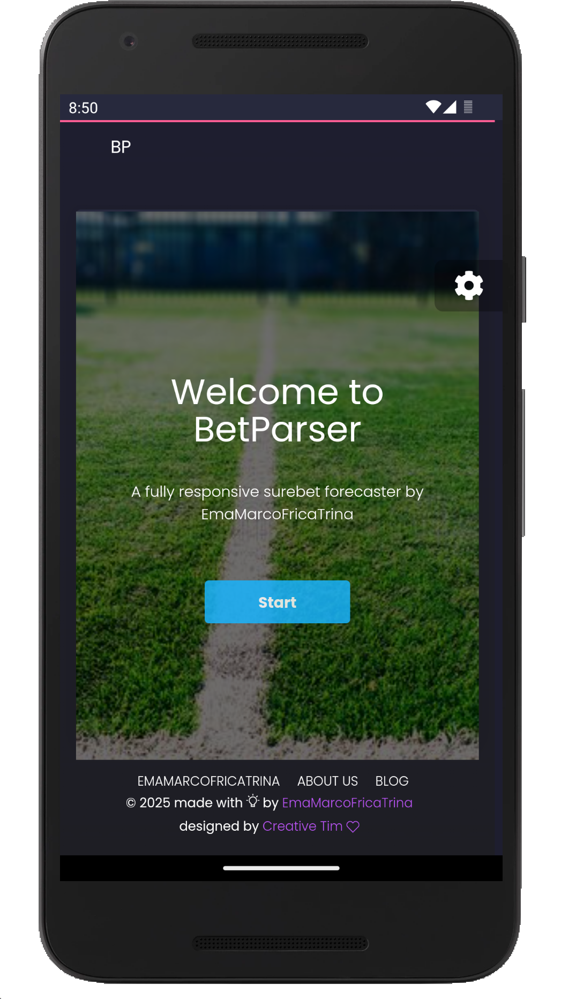
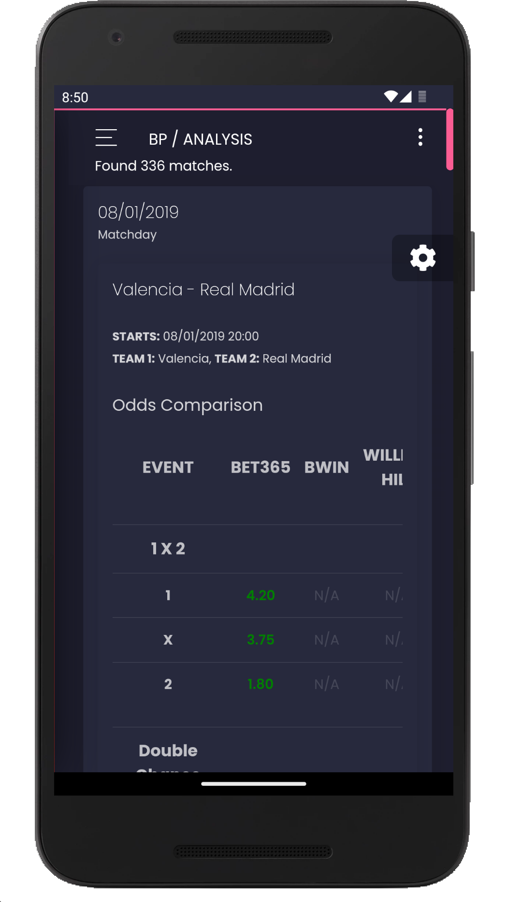
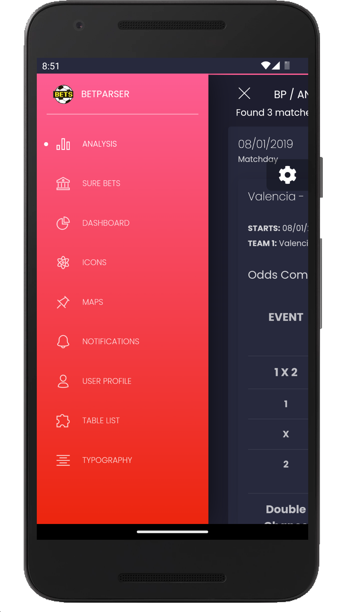
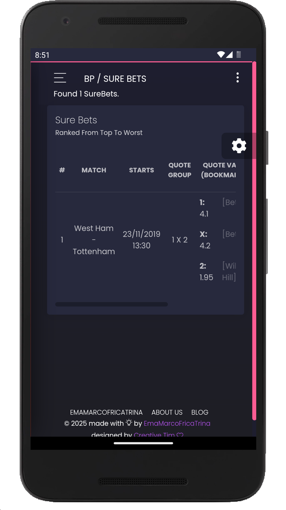

# BetParser WebView

BetParser WebView is an Android app that allows users to monitor live bets and analyze surebets/valuebets in real time, offering a native-like experience for accessing the BetParser web application.

## Disclaimer

This software is provided for educational and research purposes only. The authors of this project do not condone or encourage any illegal activities, including but not limited to unauthorized data scraping or infringement of intellectual property rights.

All trademarks, logos, and brand names mentioned in this project (e.g., Bwin, Bet365, William Hill, Sisal, Eurobet, etc.) are the property of their respective owners. The use of these names is for identification purposes only and does not imply endorsement or affiliation.

By using this software, you agree that the authors are not liable for any misuse or legal consequences arising from its use. It is your responsibility to ensure compliance with all applicable laws and regulations in your jurisdiction.

## Table of Contents

1. [Project Overview](#project-overview)
2. [Features](#features)
3. [Screenshots](#screenshots)
4. [Environment Setup](#environment-setup)
   - [Clone the Repository](#clone-the-repository)
   - [Setup Steps](#setup-steps)
5. [Usage](#usage)
   - [How to Run](#how-to-run)
   - [Permissions](#permissions)
6. [Development](#development)
   - [Project Structure](#project-structure)
   - [Technical Implementation](#technical-implementation)
   - [Debugging](#debugging)
7. [Support](#support)
8. [License](#license)

## Project Overview

BetParser WebView bridges the gap between the [BetParser Angular WebApp](https://github.com/mtmarco87/betparser_webapp.git) and Android devices by embedding the web application into a native-like environment. This app is tailored for bettors and analysts who need a reliable and efficient tool for live bets monitoring and surebets/valuebets analysis.

The app provides key features such as session persistence and improved navigation to enhance usability, making it robust for real-time betting insights. By combining simplicity with essential functionality, BetParser WebView delivers a smooth and intuitive experience for its users.

## Features

- **WebView Integration**: Displays the BetParser Angular WebApp seamlessly within an Android WebView.
- **LocalStorage Support**: Ensures user preferences and session data are preserved.
- **Session Persistence**: Saves and restores the WebView state during app lifecycle events.
- **Screen Orientation Handling**: Supports smooth transitions during screen flips.

## Screenshots

Here are some screenshots of the BetParser WebView in action:



### Live Odds Analysis

<div style="display: flex; justify-content: center; gap: 10px;">
  
  
</div>

### SureBets Detection



## Environment Setup

### Clone the Repository

Clone this repository to your local machine using the following command:

```bash
git clone https://github.com/mtmarco87/betparser_webview.git
```

### Setup Steps

1. **Install Android Development Tools**

   - Install the Android Development Kit (ADK).
   - Install the Android Emulator (if debugging on a PC). Alternatively, you can use ADB to debug directly on your smartphone.

2. Open the project in Android Studio.
3. Gradle will automatically handle dependencies and project setup.

4. **Configure the BetParser WebApp URL**

   - Open the file `res/values/strings.xml` located at:
     ```
     app/src/main/res/values/strings.xml
     ```
   - Replace the placeholder URL in the `betparser_webapp_url` string with your own BetParser WebApp URL. For example:
     ```xml
     <string name="betparser_webapp_url">https://your.betparser.webapp.url/</string>
     ```
   - Save the file and rebuild the project in Android Studio.

## Usage

### How to Run

1. When building a signed APK, create a keystore for signing the app.
2. Run the app on an emulator or a connected Android device.

### Permissions

The app requires the following permission:

- **Internet Access**: To load the BetParser Angular WebApp.

## Development

### Project Structure

- **MainActivity.java**: Contains the core logic for initializing and managing the WebView.
- **res/layout/activity_main.xml**: Defines the layout with a full-screen WebView.
- **res/values/**: Contains app resources like strings, colors, and styles.
- **AndroidManifest.xml**: Configures app permissions and declares the main activity.

### Technical Implementation

The app loads the BetParser Angular WebApp into a WebView. It enables JavaScript and DOM storage for a smooth user experience. The app also handles lifecycle events to save and restore the WebView state, ensuring continuity for the user.

### Debugging

1. Add a new Android Run/Debug Configuration in Android Studio, pointing to the `MainActivity` of the app.

2. If needed, open the AVD Manager in Android Studio to configure and launch an Android emulator for testing.

## Support

If you find this project useful, consider supporting its development:

- ⭐ Star the repository to show your appreciation.
- 💬 Share feedback or suggestions by opening an issue.
- ☕ [Buy me a coffee](https://buymeacoffee.com/mtmarco87) to support future updates and improvements.
- 🔵 BTC Address: `bc1qzy6e99pkeq00rsx8jptx93jv56s9ak2lz32e2d`
- 🟣 ETH Address: `0x38cf74ED056fF994342941372F8ffC5C45E6cF21`

## License

This project is licensed under the [MIT License](LICENSE). See the `LICENSE` file for details.
